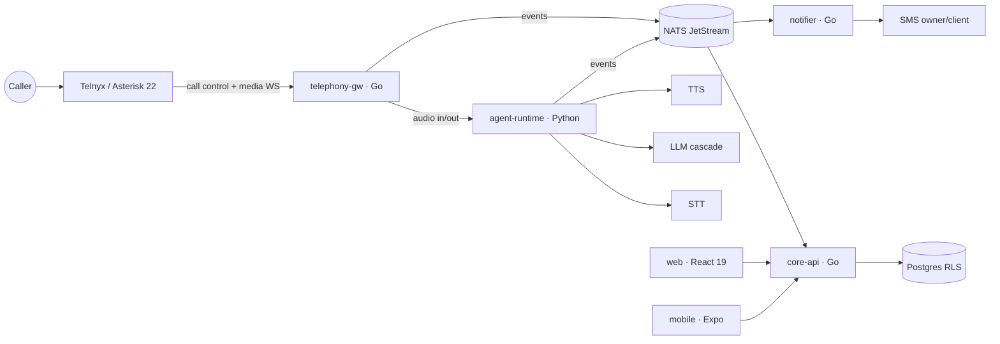

# FrontDesk AI

**Bilingual (EN/FR-CA) AI voice receptionist for Canadian service businesses** — answers the
business line in overflow mode, qualifies the caller, books the job and notifies the owner,
in the caller's language.

> Service SMBs (plumbers, electricians, HVAC — clinics as a second vertical) lose jobs because
> nobody picks up the phone while the owner is on a job site. Voicemail doesn't convert: a caller
> with a burst pipe dials the next result on Google Maps. FrontDesk AI answers within seconds,
> speaks real EN **and** FR-CA (Québec's Law 96 makes French-first support a hard requirement the
> US-first players ignore), and only steps in when a human doesn't — removing the
> "I don't want a robot answering my customers" objection.

## What it does

- **Overflow-first**: the AI answers only if nobody picks up within N seconds (per-tenant),
  with an always-on mode for after-hours. Tenants keep their existing number (Canadian DID
  via Telnyx or ring group overlay).
- **Qualifies and books**: service type, postal code, urgency — then books directly into the
  owner's calendar or takes a structured message.
- **Warm transfer on emergencies**: keyword rules ("flood", "burst pipe") ring the owner's
  cell immediately, with context.
- **Notifies both sides**: SMS summary to the owner in under 60 s, confirmation to the caller,
  weekly report.
- **Truly bilingual**: language detection on the first utterance, EN/FR-CA prompts, PII
  handling and notifications in both languages.
- **Never drops a call**: a degradation ladder (provider circuit breakers, LLM hedging,
  scripted fallback, audio bank) keeps the line useful even when upstream AI providers fail.

## Architecture

Event-sourced core: every call emits typed events to NATS JetStream and all state — call
timeline, billing, notifications — is a deterministic fold over that stream
(`state = fold(events)`). The event contracts in [`contracts/`](contracts/) are the single
source of truth shared by Go, Python and TypeScript.



| Service | Stack | Role |
|---|---|---|
| `telephony-gw` | Go | Telnyx call control + media WebSocket, turn state machine, adaptive EN/FR endpointing, two-level barge-in, degradation ladder, per-provider circuit breakers |
| `agent-runtime` | Python | LangGraph conversation graph (greeting → qualification → booking \| message), STT/LLM/TTS behind `Protocol`s, model cascade, guardrails + prompt-injection defense |
| `core-api` | Go | Tenants, DIDs, calls, bookings, messages, billing — Postgres with row-level security, tenant only ever resolved from context |
| `notifier` | Go | Owner/client SMS (EN/FR), dedup, weekly report — all folded from call events |
| `web` / `mobile` | React 19 + Vite / Expo SDK 54 | Owner dashboard and app: call review with player + transcript + event timeline, messages, bookings, overflow toggle, onboarding |

Two interchangeable media backends (`MEDIA_BACKEND=telnyx|asterisk`): Telnyx-hosted media, or
a self-hosted **Asterisk 22** container driven over ARI with external media UDP
([ADR-009](specs/adr/ADR-009-asterisk-media-backend.md)).

## Repository layout

```
specs/            PRD · EPICs · ADR-001..010 · CONTEXT.md (domain digest)
contracts/        JSON event schemas — the Go ↔ Python ↔ TS contract (18 event types)
go/               Go services (uber-go style): cmd/{telephony-gw, core-api, notifier}
python/           agent-runtime (LangGraph; STT/LLM/TTS providers via Protocol, incl. ElevenLabs)
apps/             web (React 19 + Vite + TanStack) · mobile (Expo SDK 54 + expo-router)
packages/shared   zod schemas mirroring the Go domain · typed /v1 client · EN/FR i18n
asterisk/         Self-hosted media backend: Dockerfile + ARI/PJSIP configs
infra/            docker/ · k8s/ (kustomize base + overlays) · observability/
                  (otel-collector, Prometheus, Loki, Tempo, Grafana dashboards)
```

Product specs and ADRs are written in Portuguese (pt-BR); code, commits and APIs are in English.

## Quickstart

Local stack with Docker Compose (infra + observability + all services):

```sh
make up                                # Telnyx media backend
make up PROFILES="--profile asterisk"  # + self-hosted Asterisk media backend
```

- Web dashboard: `http://localhost:3000` · core-api: `:8080` · telephony-gw: `:8081`
- Grafana: `http://localhost:3001` (`admin`/`admin`) — FrontDesk dashboards (voice health,
  call funnel, business) and Prometheus/Loki/Tempo datasources pre-provisioned.

Kubernetes (kustomize):

```sh
kubectl apply -k infra/k8s/overlays/dev    # or prod
# Grafana dashboards live outside the kustomization root:
kustomize build --load-restrictor LoadRestrictionsNone infra/k8s/overlays/dev | kubectl apply -f -
```

Fill in `infra/k8s/base/secrets.yaml` first (see `SECRETS.md`). `MEDIA_BACKEND` and the
Asterisk envs live in `base/configmap.yaml`; the Asterisk Deployment ships at `replicas: 0`
(RTP on k8s needs hostNetwork or a dedicated node — see comments in
`base/asterisk/asterisk.yaml`).

## Development

| Area | Commands |
|---|---|
| Go | `cd go && go build ./... && go vet ./... && go test ./...` |
| Python | `cd python/agent-runtime && uv sync && uv run pytest && uv run ruff check . && uv run mypy src` |
| Frontend | `pnpm install && pnpm -r typecheck` (Node ≥ 20.19; pnpm 11 via corepack — prefer Node 22/24) |
| Web dev | `cd apps/web && pnpm dev` (set `VITE_API_URL` to the core-api `/v1`) · `pnpm build` · `pnpm preview` |
| Mobile dev | `cd apps/mobile && pnpm start` (`pnpm ios` / `pnpm android`) · `pnpm typecheck` · `npx expo-doctor` |

The mobile app consumes `@frontdesk/shared` from source (no build step);
`metro.config.js` extends the default `watchFolders` with the workspace root for hot reload.

Pinned versions live in [`VERSIONS.md`](VERSIONS.md). Phase-by-phase progress is tracked in
[`CHECKPOINT.md`](CHECKPOINT.md).

## Design decisions

The `specs/adr/` directory records the load-bearing choices, including:

- **ADR-002** — Go for the realtime/IO plane, Python for the agent plane
- **ADR-003** — events as the source of truth (deterministic fold, no dual writes)
- **ADR-005** — multi-tenancy via Postgres RLS, tenant only from request context
- **ADR-006** — degrade, never drop: the ladder from full AI down to scripted + audio bank
- **ADR-009** — self-hosted Asterisk media backend behind the same `media.Backend` interface
- **ADR-010** — observability: OTel traces/metrics/logs, Grafana stack, per-call trace IDs

## Status

Pre-launch. Backend (16 Go packages, 44 Python tests, ruff/mypy strict), frontend (web +
mobile) and infra are implemented and verified with `go test` / `pytest` / `tsc`; the
compose/k8s/observability layer has been validated statically (parsed YAML, cross-checked
ports, env names and volume paths) and may need runtime fine-tuning on first real
`docker compose up` / `kubectl apply`.
